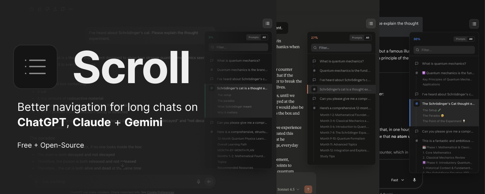
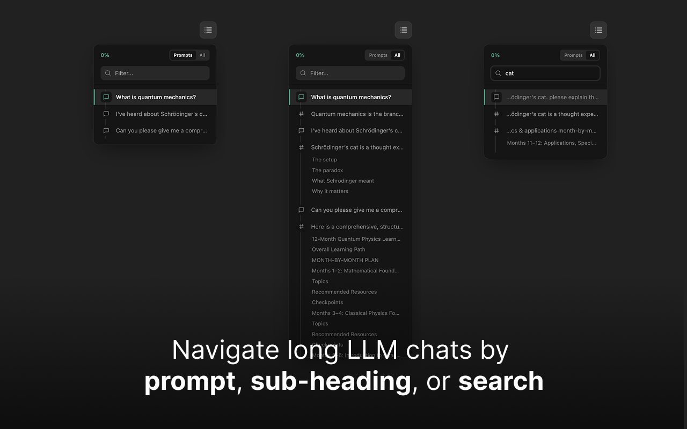

# Scroll 🧭

> **Navigate ChatGPT, Claude & Gemini conversations without endless scrolling.**

  

  
  
  
  

## ⚡️ The Solution

AI chat interfaces weren't designed for long conversations. Finding a specific prompt from 20 minutes ago requires endless scrolling.

**Scroll** adds a native navigation sidebar to your chats. It auto-generates a table of contents based on your prompts and headers, letting you jump instantly to what matters.

  

## ✨ Features

  

- **One-Click Navigation:** Jump to any turn in the conversation instantly.
- **Heading Support:** Automatically detects headings (`#`, `##`) inside long AI responses.
- **Search & Filter:** Type to find that one specific code snippet or idea.
- **Privacy Focused:** Runs 100% locally. No data leaves your browser.
- **Keyboard Shortcuts:** Keep your hands on the keyboard (`Cmd/Ctrl + .` to toggle).

## 📥 Installation

### Option 1: Web Stores (Recommended)
* **Chrome / Brave / Edge:** *(Pending Review)*
* **Firefox:** *(Coming Soon)*

### Option 2: Manual Install (From Source)
If you want the latest version immediately, you can install it manually.

**1. Get the Code**
* **Method A (No Git):** [Click here to Download ZIP](https://github.com/asker-kurtelli/scroll/archive/refs/heads/main.zip), then unzip the folder.
* **Method B (Git):**
``
  git clone https://github.com/asker-kurtelli/scroll.git
  ``

**2. Install in Browser**

| Chrome / Edge / Brave | Firefox |
|:---|:---|
| 1. Go to `chrome://extensions`   2. Toggle **Developer Mode** (top right)   3. Click **Load Unpacked**   4. Select the `scroll` folder | 1. Go to `about:debugging#/runtime/this-firefox`   2. Click **Load Temporary Add-on**   3. Select the `manifest.json` file inside the `scroll` folder   *Note: Firefox removes temporary extensions when you restart the browser.* |

## ⌨️ Shortcuts

| Shortcut | Action |
|----------|--------|
| `Cmd/Ctrl` + `.` or `;` | Toggle Panel |
| `↑` / `↓` or `j` / `k` | Navigate Down/Up |
| `Enter` | Jump to Message |
| `Esc` | Close Panel |
| `←` / `→` | Toggle View (Prompts/All) |

## 🗺️ Roadmap

  - [x] Basic navigation & Search
  - [x] Heading navigation (Markdown support)
  - [x] Firefox support (Manifest V3)
  - [ ] Pin favorite responses
  - [ ] Export conversations
  - [ ] Custom themes
  - [ ] Conversation bookmarks

## 🔒 Privacy

Scroll is open source and privacy-first.

  - **No Tracking:** We do not collect user analytics.
  - **No Data Transmission:** Chat content never leaves your browser.
  - **Local Only:** All processing happens inside `content.js`.

## 🤝 Contributing

Contributions are welcome\!

1.  Fork the repo.
2.  Create a branch (`git checkout -b feature/amazing-feature`).
3.  Make changes (Codebase is Vanilla JS, no build steps required).
4.  Submit a PR.

See [CONTRIBUTING.md](https://github.com/asker-kurtelli/scroll/blob/main/contributing.md) for detailed guidelines.

## 📜 License

MIT License - Free and Open Source forever.

-----

Built by <a href="https://x.com/askerkurtelli">Asker Kurt-Elli</a>
 
<i>If Scroll saves you time, give it a ⭐️ on GitHub!</i>

